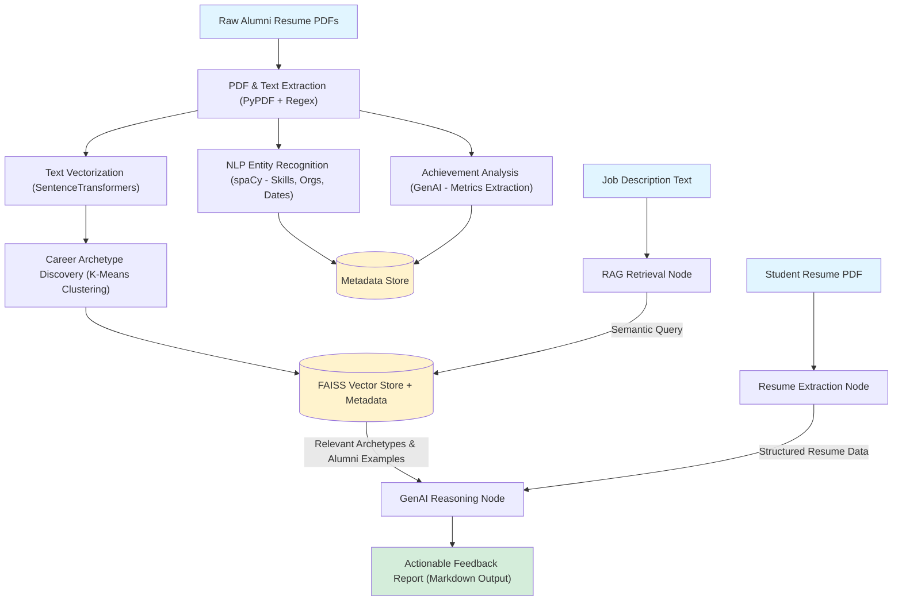

# SRM Career Catalyst  
### Intelligent Resume Analysis Engine

SRM Career Catalyst is an advanced, **data-driven backend system** designed to analyze student resumes against job descriptions. Unlike standard keyword matchers, this system leverages a **Knowledge Genome** built from the resumes of **successfully placed alumni** to provide **context-aware, actionable feedback**.

The platform integrates **Traditional NLP**, **Unsupervised Machine Learning**, and **Generative AI** to uncover real-world placement patterns and guide students toward improved placement outcomes.

---

## 🧠 Key Idea

> *"Compare a student not to a job description alone, but to the profiles of alumni who actually got placed."*

---

## 🏗️ System Architecture



---

## 🔍 Phase 1: Offline Data Pipeline

This phase builds the **intelligence layer** of the system.

### 1. Data Extraction
- Converts unstructured alumni resume PDFs into structured text.
- Tools: `PyPDF`, `Regex`

### 2. Entity Recognition
- Extracts skills, organizations, roles, and timelines.
- Model: `spaCy (en_core_web_lg)`

### 3. Achievement Analysis
- Uses GenAI to identify **quantifiable achievements**.
- Example:
  - `"Reduced latency by 20ms"` → `Speed / Performance`
- Model: `gpt-4o-mini` (via GitHub AI + Azure SDK)

### 4. Archetype Discovery
- Converts resumes into dense embeddings.
- Uses **K-Means clustering** to discover natural career archetypes.
- No manual labels required initially.

### 5. Vector Store Creation
- Embeddings and metadata indexed using **FAISS**.
- Enables high-speed semantic retrieval during inference.

---

## ⚡ Phase 2: Online Inference Engine

This phase exposes the system as a **REST API**.

### Workflow
1. **Request Handling**
   - Resume PDF + Job Description received via FastAPI.

2. **Orchestration**
   - Workflow managed using **LangGraph**:
     - Extraction → Retrieval → Reasoning

3. **RAG (Retrieval-Augmented Generation)**
   - Retrieves the most relevant alumni archetypes from FAISS.

4. **Synthesis**
   - GenAI compares student profile against:
     - Successful alumni patterns
     - Required job skills
     - Quantified achievements

5. **Output**
   - Markdown-formatted feedback
   - Skill gaps
   - Missing metrics
   - Resume improvement suggestions

---

## 🛠️ Technology Stack

### Core
- **Language:** Python 3.9+
- **API:** FastAPI, Uvicorn
- **Workflow:** LangGraph, LangChain

### AI & ML
- **Generative AI:** GitHub AI (openai/gpt-4o-mini)
- **NLP:** spaCy (NER)
- **ML:** Scikit-Learn (K-Means, TF-IDF)
- **Embeddings:** Sentence-Transformers (`all-MiniLM-L6-v2`)

### Storage & Processing
- **Vector DB:** FAISS (CPU)
- **Data:** Pandas, NumPy
- **PDF Parsing:** PyPDF, Regex

---

## 📂 Project Structure

```
Placement-Project/
├── processed_data/
│   ├── structured_resumes.csv
│   ├── resumes_with_metrics.csv
│   ├── clustered_resumes.csv
│   ├── embeddings.npy
│   └── archetype_insights.json
├── vector_store/
│   ├── srm_resumes.index
│   └── srm_resumes.pkl
├── data/
│   └── raw_resumes/
├── extract_resume_data.py
├── analyze_achievements.py
├── cluster_resumes.py
├── label_archetypes.py
├── build_vector_store.py
├── services.py
├── graph.py
├── models.py
├── main.py
├── requirements.txt
└── .env
```

---

## 🚀 Setup & Installation

### 1. Prerequisites
- Python **3.9+**
- GitHub Account (for Personal Access Token)

### 2. Environment Setup

```bash
python -m venv .venv

# Windows
.\.venv\Scripts\Activate.ps1

# Mac/Linux
source .venv/bin/activate
```

### 3. Install Dependencies

```bash
pip install -r requirements.txt
```

### 4. Download NLP Models

```bash
python -m spacy download en_core_web_lg
```

### 5. Configuration
Create a `.env` file in the project root:

```env
GITHUB_TOKEN="your_github_pat_token_here"
```

---

## ⚙️ Execution Guide (Building the Knowledge Base)

### Step 1: Extract Resume Data

```bash
python extract_resume_data.py
```

### Step 2: Analyze Achievements (GenAI)

```bash
python analyze_achievements.py
```

### Step 3: Clustering

**Run 1: Generate elbow plot**

```bash
python cluster_resumes.py
```

- Inspect `elbow_plot.png`
- Update `OPTIMAL_K` in the script

**Run 2: Final clustering**

```bash
python cluster_resumes.py
```

### Step 4: Label Archetypes

**Run 1: Inspect keywords**

```bash
python label_archetypes.py
```

- Update `ARCHETYPE_LABELS`

**Run 2: Save labeled insights**

```bash
python label_archetypes.py
```

### Step 5: Build Vector Store

```bash
python build_vector_store.py
```

---

## ⚡ Running the API Server

```bash
python -m uvicorn main:app --reload
```

Server runs at:

```
http://127.0.0.1:8000
```

---

## 📡 API Documentation

### Endpoint

```
POST /analyze
```

### Parameters
- **job_description** (Query Parameter): Full job description text
- **resume_file** (Body): Student resume PDF

### Response
- Streaming Markdown text
- Alumni archetype comparison
- Skill gap analysis
- Actionable resume recommendations

---

## 🎯 Outcome

SRM Career Catalyst moves beyond resume screening and into career intelligence, enabling students to align their profiles with real-world placement success patterns.

---

## 📜 License

For academic and research use. Extendable for institutional deployment.